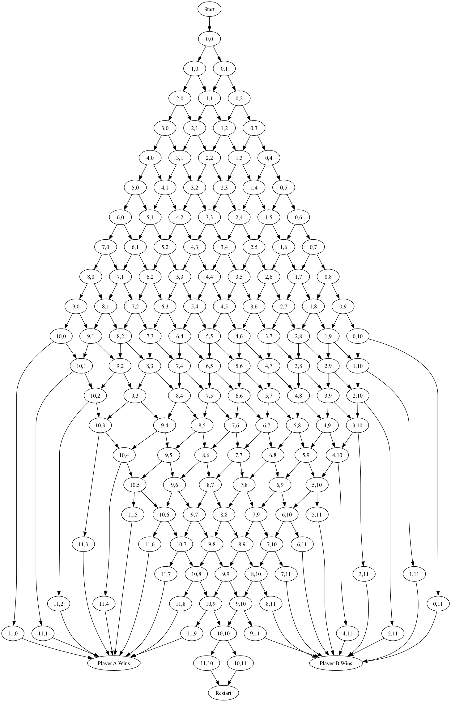
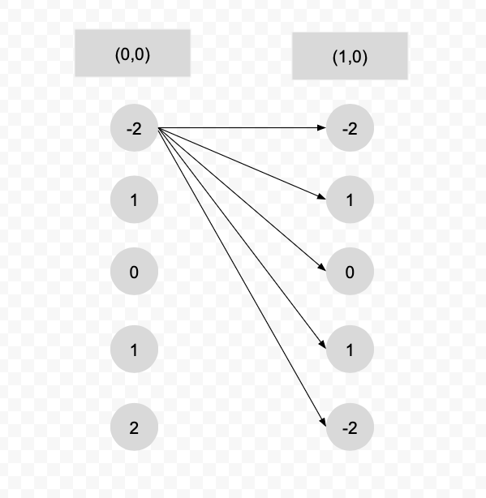
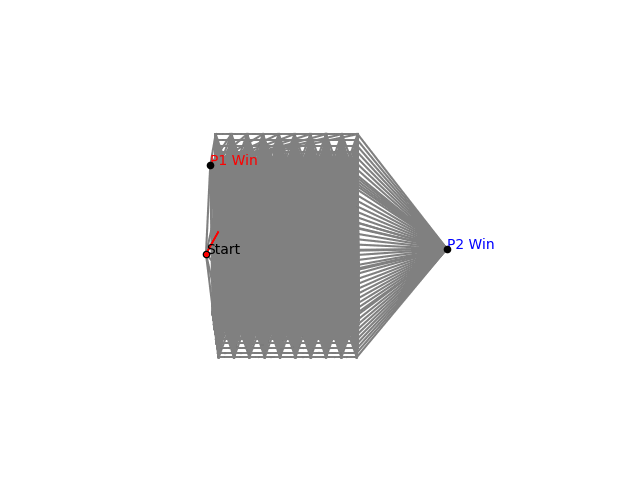
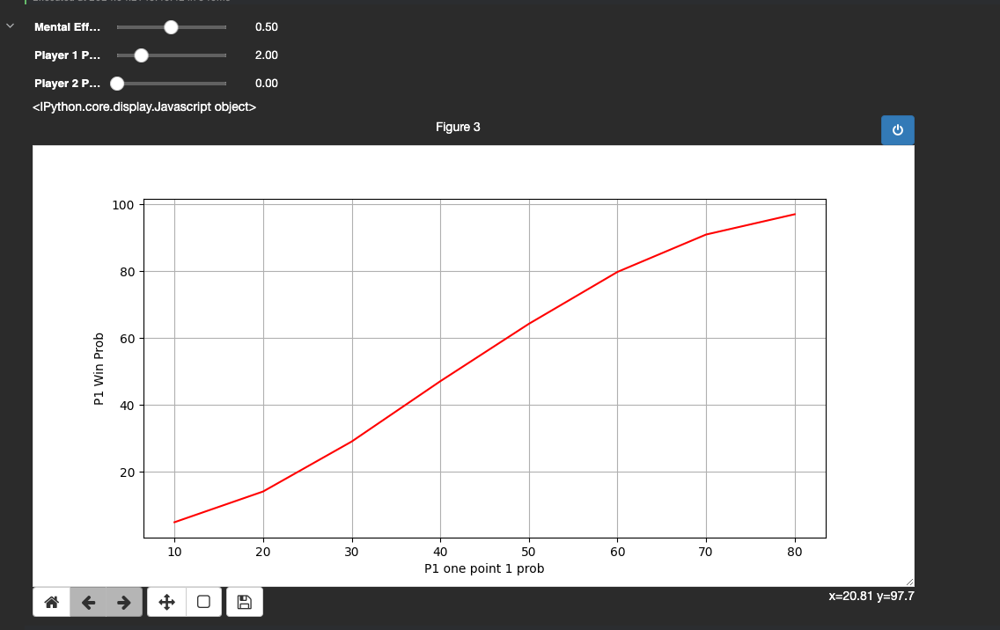

## Predicting Squash Outcomes with a 3D Markov Chain
### Oliver Eielson
---

# Abstract
This study aims to create a predictive model for squash matches that integrates players' mental states into a 3D Markov chain[^1].  
Current models fail to incorporate players' mental states in their prediction, which often results in lower performance. Unlike the current models, players' mental states are built directly into the model, which results in more robust predictions. The model employs a 3D Markov chain where the x and y axis model the state of the game while the z-axis models the player's mental state. The resulting model now allows for accurate predictions from any point in the match for any combination of players. Additionally, initial results have validated some yet unproven theories of players' optimal strategies. The model has validated the theory that the optimal strategy for weaker players is usually to devolve the match into chaos in an attempt to force mental factors to be more important than skills. The model improves current prediction capabilities and improves our understanding of how psychological factors play into match outcomes.

[^1]: [Explanation of Squash](https://youtu.be/9V8vN1bw730?si=2kDKIapy8Tduedfj)

---

# Summary of Problem
Predicting the outcome of sports, specifically squash, is a notoriously difficult problem. Many factors need to be considered to model the outcome of a game accurately. Currently, some models exist that attempt to predict a player's skill level based on past results. However, these models routinely fall short as, for various factors, players do not always play at "their skill level." One of the main reasons for this varying performance is players' psychological and mental states. For example, a scared or nervous player will often play worse one match but perform far better with a different mental state. Furthermore, these mental states can change throughout the match as seen with the concept of momentum. The goal of this project is to build a model that can more accurately predict outcomes by accounting for these mental fluctuations.

---

# Literature Review
As squash is a relatively niche sport, there are very few models that have been specifically designed to model squash. Currently, the only feasible model that exists is the US squash rating system [@USSQUASH]. The exact details of the model are secret, but it is loosely based on the ELO rating system. It assigns each player a rating from 0 to around 7 (there is no upper bound) based on previous match performance. However, this model only observes the final match outcome, leaving out the dynamics of the match.

While there are few models that specifically model squash, there are some applicable models designed for tennis. While playing tennis is very different than squash, from a mathematical modeling perspective the two sports are relatively similar. Most papers attempt to create a rating system similar to US Squash or use statistical analysis to predict the outcomes of matches. However, very few papers have attempted to model the game to predict the outcome. One such paper by Sébastien Cararo, models tennis games using Markov chains [@tennis]. The model he created works by defining a game as a state machine and served as the initial inspiration for this paper. However, unlike the model proposed in this paper, his model assumes a constant probability of winning each point and does not include psychological factors.

---

# Model
The proposed model uses a 3D Markov chain to predict the winner of a squash game. A Markov chain is well suited to this problem because the rules of squash can easily be encoded as a state machine (Figure 1). A standard squash match is played as a best of 5 games, with each game to 11 points. However, like tennis, a player must win by two points to win a match. For simplicity of calculations, we will only model one game and reset the game back to the start if it reaches a tiebreak. Figure 1 below shows the 2D finite state machine that encodes these rules.

**Figure 1**  

This simple state machine will be the basis for the new 3D Markov chain that incorporates players' mental states. The explanation of this new model has been broken up into two sections:  
1. An explanation of the graphical structure of the Markov chain.  
2. An explanation of the probabilities used to calculate the transition table.  

## Graph Structure
To incorporate psychological factors and fluctuations into the model, the graph in Figure 1 was augmented. Several versions of the graph in Figure 1 are created and stacked vertically, as seen in Figure 3.

In the new 3D graph, each level represents a different mental state. The higher the level, the more player 1 is favored; the lower the level, the more player 2 is favored. This encodes the idea that if Player 1 has a psychological advantage, the probability of them winning a point is higher and vice versa. The levels were then connected together as shown in Figure 2. Each node at each level was connected to all the nodes at the other level. This encoded the idea that a player's mental state can change to any value at any point. The probabilities were set so that the further the level, the less likely the transition was. This was to incorporate the fact that large mental swings are far less likely than subtle changes. Regardless of level, all paths were sent to the same "winning" node. Like in Figure 1, the winning nodes were connected to the start node to make the chain circular. As a game can start at any level, the start node was then connected to the (0,0) node at each level.

**Figure 2**  

**Figure 3**  

## Equations
This section will outline the formulas used to create the transition probabilities. These probabilities will allow the graph outlined in the previous section to be converted into a transition matrix.

### Notation
- \( P1 = p \) (Probability that player 1 wins a point).  
- \( P2 = (1 - p) \) (Probability that player 2 wins a point).  
- \( M_e \) is the mental effect and is a decimal value (0-1), describing how much the game is affected by the player's mental state.  
- \( L_C \) is the current level.  
- \( M_R \) is the mental range, which describes the number of levels.

### Start Node → (0,0,m)
\[
\mathds{P}(0,0,m) = \frac{1}{M_r}
\]
The start node is not a part of the game structure but was added to model the differing mental states going into a match. For example, say a player is about to play a long-time rival and is very nervous. His mental state from point 0-0 might favor the opponent. We assume that we are equally likely to start a match at any level.

### Win Nodes → Start Node
\[
\mathds{P}(Start Node) = 1
\]
The probability of going to the start node is 100\%, as there are no other nodes to go to. This transition is only included in the chain to make the graph circular. This allows the model to reset itself after each game.

### Game Nodes → Win Nodes
\[
\mathds{P}(P1_{Wins}) = P1 + M_e \times \biggl(L_c - \frac{1 + M_r}{2}\biggr)
\]  
\[
\mathds{P}(P2_{Wins}) = P2 - M_e \times \biggl(L_c - \frac{1 + M_r}{2}\biggr)
\]
The probability of either player winning at any point is \(P1\) or \(P2\). However, these values are augmented by the current level and mental effect. Thus, to calculate the new probability, we calculate the current level, multiply it by the mental effect, and then add or subtract it from the original probability. The result is the probability of transitioning to the new node.

### Game Nodes → Game Nodes
\[
\text{P(x+1,y)} \;=\; \frac{ \bigl( P1 + M_e \times (L_c - \frac{1+M_r}{2}) \bigr) \times \frac{1}{1 + |L_c - L_n|} }{ \sum_{M_r} \frac{1}{1 + |L_c - L_n|} }
\]

\[
\text{P(x,y+1)} \;=\; \frac{ \bigl( P2 - M_e \times (L_c - \frac{1+M_r}{2}) \bigr) \times \frac{1}{1 + |L_c - L_n|} }{ \sum_{M_r} \frac{1}{1 + |L_c - L_n|} }
\]
Going from one game node to another is the most complicated case. This is because we must calculate the probability of either player winning and then calculate the probability of changing levels. To calculate the probability of either player winning, we use the same formula as in the last section. Then, to calculate changing levels, we use the formula \(\frac{1}{1 + |L_c - L_n|}\), which lowers the probability of changing levels the further away the next level is. We then normalize the probabilities to ensure that they sum to 1 in order to ensure the transition table remains stochastic.

## Calculations
Once the graph and transition probabilities have been computed, the match's outcomes can be computed. The probability of being in any state can be calculated by finding the eigenvectors of the transition matrix and normalizing them. The probabilities for the nodes "P1 Win" and "P2 Win" are normalized and used as the final prediction.

## Assumptions
- **Initial Probabilities**: We assume the base probabilities of each player winning a point remains constant. For example, we assume that P1 does not improve their skill level during the match or develop a strategy mid-game that improves their odds of winning. Additionally, this assumes that neither player gets hurt during the match, which negatively affects their skill level.  
- **Game Reset**: We disregard any concept of tie break as the dynamics remain the same as in the regular match. Additionally, since tie breaks can go infinitely and Markov chains need to be finite, removing the tie break simplified calculations.  
- **Mental Effect**: The mental state has a symmetric effect on the probability of winning a point; it can either positively or negatively impact the player's performance. Thus, if a player's mental state positively increases his chance of winning by 5\%, then it hurts the opponent's chance by 5\%. Future versions of the model would benefit from removing this assumption and instead develop a model that is not symmetric.  
- **Mental State Dynamics**: The mental state of a player at any given point is influenced by the game's progress and can transition between different levels, reflecting changes in player confidence or stress. Furthermore, we assume that it is more likely that a player's mental state changes by small increments and not massive jumps. This assumption closely matches presumed real-world probabilities. It is rare that a player goes from losing mentally to winning in one point, but it does happen sometimes.

## Random Walk Example
Using the transition probabilities and graph structure, an example random walk was defined. The random walk does not help with calculations but provides an example of how the model works.

**Figure 4**  

---

# Discussion
Different simulations were run using the model described above and the code in the appendix. These simulations yielded two main results:

### Chaos is a Ladder
While not a novel discovery, the model confirms a long-held theory that the weaker player's optimal strategy is to try to devolve the match into chaos. This was discovered by calculating the "game shape." A simulation was run for every combination of P and mental effect, resulting in Figure 5.

**Figure 5**  

From the graph, it was observed that when the P1 probability was close to 0 or 1, the mental effect had a much larger effect on the outcome. For example, when P1 is 0.1 (P1 has a 10% chance of winning any point) and the mental effect is 0.1, player 1 only has a 1.148% chance of winning the game. However, if the mental effect is raised to 0.99, P1 now has a 17.5% chance of winning the game. Importantly, the chance of P1 winning the game is now higher than their chance of winning an individual point. However, when P1 and P2 are both 0.5, the mental effect has no effect on the percent chance of either player winning. This confirms the theory that the weaker player's optimal strategy is to try to devolve the match into chaos.

### Predictions
As the model is very modular, it can be used to predict match outcomes. The figure below shows an interactive graph developed to quickly predict match results in real-time.

**Figure 6**  

The sliders allow the user to change the mental effect and score of the match. The widget will then output a graph showing the chance of winning the match based on P1's chance of winning a point. This application of the model has the most real-world application as there are many times when predicting the outcome of a match is extremely useful. The original plan was to compare these results against real-world results; however, since US Squash hid all their data behind a paywall, no comparison could be made.

---

# Model Weaknesses

### Model Inputs
George E. P. Box famously said, "All models are wrong, but some are useful," and this is no exception. One of the model's larger weaknesses is its inputs. The model assumes that values for the percent chance of player 1 winning a point and the Mental effects are accurate, while in reality, it is extremely hard to estimate them. This problem was considered when designing the model; however, since there is no available match data, there was no way to overcome it other than just assuming a correct estimate.

### Model Symmetry
Another weakness of the model is its symmetry. The model assumes that each player's mental state affects the match to the same degree. Some players are mentally stronger than others and thus have less of a chance of jumping from one level to another. This is often seen in professional sports, where some players are very stoic, and others are all over the place. However, the model assumes that each player jumps to new mental levels with the same probability. Future versions of the model should address this problem.

### Model Validation
One weakness is that the model has not been validated against real-world results. The original plan with the paper was to download a dataset of match results from US Squash. This would allow the new model to be compared with other models and determine the model’s accuracy. However, in another outrageous attempt to squeeze every penny out of their users, US Squash recently hid the data behind a paywall. Future versions of the model would benefit from more rigorous validation.

---

# Conclusion
In conclusion, this paper proposes a novel model that uses a 3D Markov Chain to predict the outcome of squash matches. Unlike past models, this model incorporates psychological factors into the Markov chain. Despite showing many promising results, the model was unable to be verified due to a lack of data. However, ultimately this model helped improve our understanding of how mental factors affect the outcome of squash matches.

---
